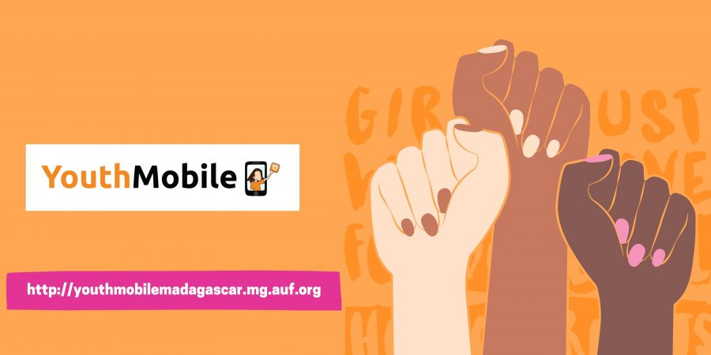
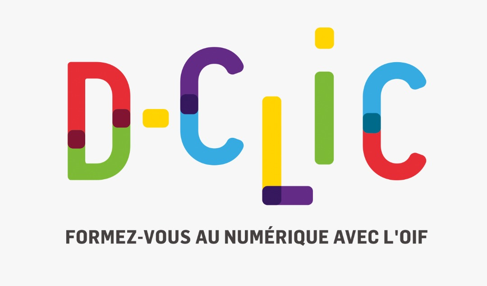
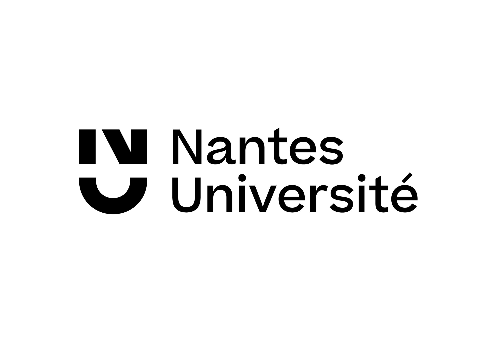

## Youth Mobile 
- *AUF* | Juillet'2021 - Novembre'2021
- 
- Tags: Youth Mobile
- Badges:
  - Entrepreunariat [purple]
  - MIT App Inventor [orange]
- List Items:
  - Une formation d’une durée de 10 semaines et d’un volume horaire de 100 heures,entièrenement à distance, en mode asynchrone (via une plateforme pédagogique dédiée) et en en mode synchrone (webinaires) 
  - Portant sur cinq thématiques : codage, robotique, design thinking, ODD,  vie après covid-19 et entrepreneuriat.

## Formation Design UI/UX 
- *Orange Digital Center* | Juin'2023
- 
- Tags: UI/UX
- Badges:
  - Adobe XD [pink]
  - figma [yellow]
  - Illustrator [green]
- List Items:
  - Recherche Utilisateur et Analyse : J'ai appris à mener des études approfondies sur les utilisateurs, à recueillir des données, à analyser les comportements et les besoins pour créer des produits centrés sur l'utilisateur.
  - Conception de Wireframes et de Maquettes : J'ai développé la capacité de créer des wireframes et des maquettes détaillés en utilisant des outils tels qu'Adobe XD, Figma et Sketch pour visualiser la structure et l'agencement des interfaces.

## Python for IA
- *Orange Digital center* | Mars'2023 
- 
- Tags: Python for IA
- Badges:
  - python [blue]
  - Flask [cyan]
  - OpenCV[teal]
- List Items:
  - Exploration des bibliothèques Python populaires utilisées dans le développement d'applications d'IA, telles que NumPy, Pandas, Matplotlib et SciPy pour le traitement des données, ainsi que TensorFlow et Keras pour la construction de modèles d'apprentissage automatique.
  - Un aperçu des réseaux de neurones artificiels et des concepts de base du deep learning.
  - Apprentissage Automatique (Machine Learning) 
  - Projet Pratique d'IA : Ainalyse  

## Formation en developpement FullStack: D-Clic
- *Sayna Academy* | Fev'2023 - Now
- 
- Tags: Sayna Space
- Badges:
  - Html [pink]
  - CSS [blue]
  - Wordpress [yellow]
- List Items:
  - Bases de l'Informatique et le Web
  - Programmation web : HTML, CSS, Bootstrap, Javascript 
  - Developpement Web : Wordpress, CMS 

## Licence en Informatique
- *Nantes UNIVERSITE* | Septembre'2021 - Maintenant
- 
- Tags: Nantes UNIVERSITE
- Badges:
  - C [pink]
  - React.JS [blue]
  - PHP [red]
  - Symphony[purple]
- List Items:
  - Etude de la Programation Orienté Objet avec C
  - Architecture des ordinateurs
  - Reseau : TCP/ IP. 
  - Programmation web : HTML, CSS, Bootstrap, Javascript, PHP
  - Manipulation de base de données avec PostgreSql