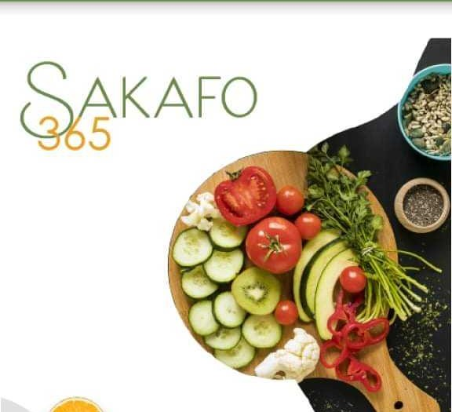
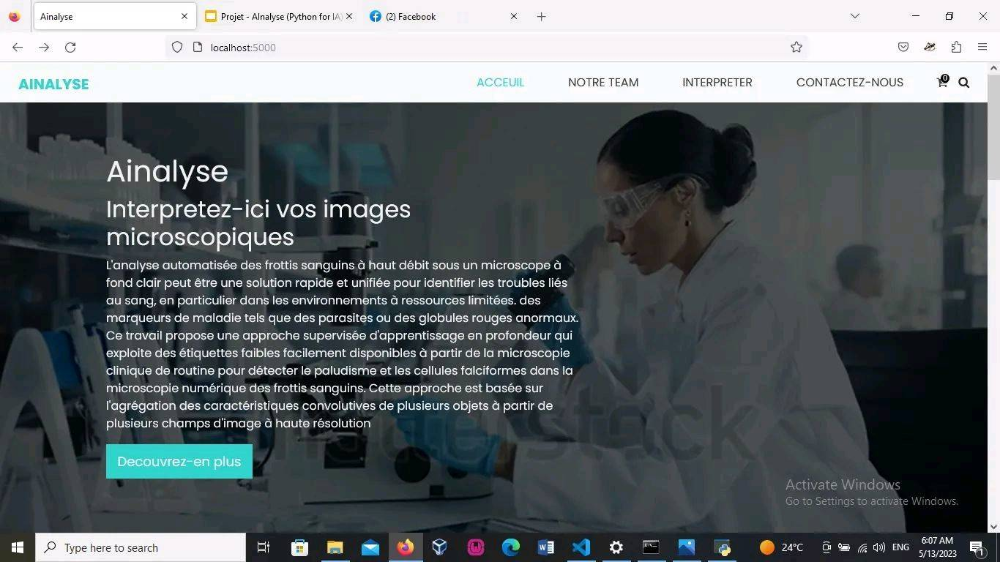

## Sakafo365
L'application "Sakafo365" conçue avec MIT App Inventor est une application mobile conviviale qui offre une multitude de recettes et de menus pour satisfaire tous les goûts et les préférences alimentaires. Cette application propose une sélection diversifiée de plats, allant des cuisines du monde entier, pour inspirer les utilisateurs dans leur aventure culinaire.
- 
- Tags: Category 1
- Badges:
  - MIT APP Inventor [blue]
- Buttons:
  - Github Repo [https://github.com/RubisRebelle/Sakafo365]

## AInalyse
L'application web "Ainalyse" est une plateforme innovante alimentée par l'intelligence artificielle, conçue pour interpréter les images microscopiques des globules sanguins avec une grande précision. En exploitant la puissance d'OpenCV (Open Source Computer Vision Library)et Flask pour le backEnd, cette application révolutionnaire permet une analyse rapide et automatisée des images, offrant ainsi une solution efficace pour le diagnostic et la recherche médicale.
- 
- Tags: Category 2
- Badges:
  - python [blue]
  - Flask [cyan]
  - OpenCV[teal]
- Buttons:
  - Github Repo [https://example.com]

## Jeux Flapping-Bird
Petit oiseau, si tu n'as pas d'ailes, tu peux pas voler... Et si tu as des ailes, tu peux t'écraser!
- 
- Tags: Category 3
- Badges:
  - Javascipt [blue]
  - HTML [cyan]
  - CSS [red]
- Buttons:
  - Github Repo [https://example.com]